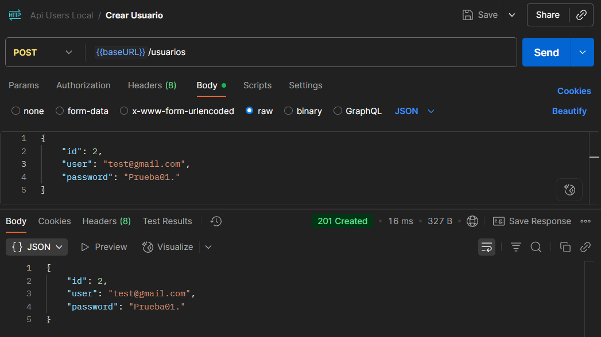
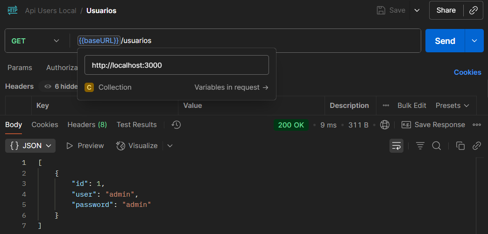
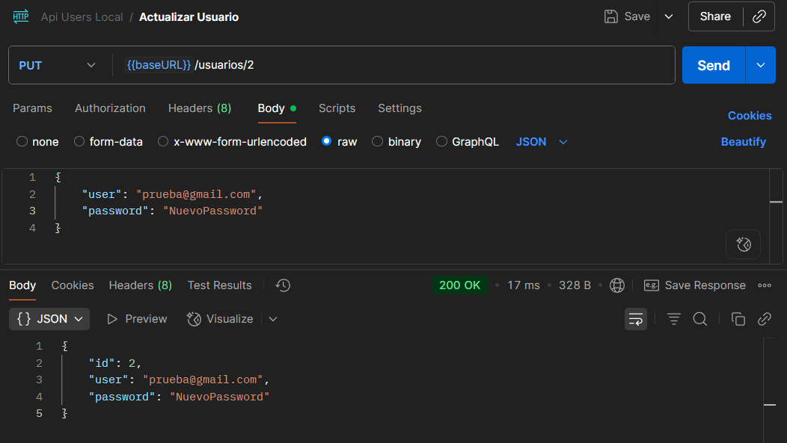
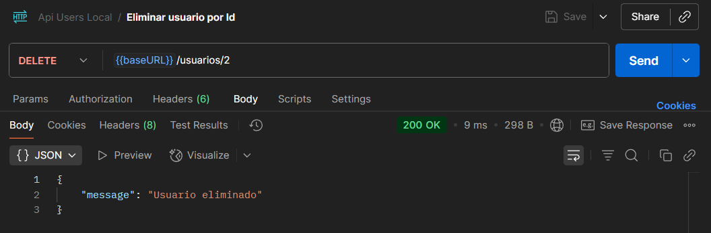

# 📌 API de Usuarios

Este proyecto incluye:
- Una **API REST** simple para gestionar usuarios (CRUD), almacenados en un archivo JSON.
- Ejemplos de pruebas con **Postman**.

---

## 🚀 Tecnologías utilizadas
- Node.js
- Express.js
- Nodemon (para desarrollo)

---

## ⚙️ Instalación
# Clonar repositorio
```
git clone https://github.com/tu-usuario/tu-repo.git
```

# Entrar al directorio
```
cd tu-repo
```

# Instalar dependencias
```
npm install
```

▶️ Ejecución
Para levantar el servidor en desarrollo:
```
npm run dev
```

📬 Endpoints de la API

| Método | Endpoint        | Descripción              |
| ------ | --------------- | ------------------------ |
| GET    | `/usuarios`     | Lista todos los usuarios |
| GET    | `/usuarios/:id` | Obtiene usuario por ID   |
| POST   | `/usuarios`     | Crea un nuevo usuario    |
| PUT    | `/usuarios/:id` | Actualiza un usuario     |
| DELETE | `/usuarios/:id` | Elimina un usuario       |


## 🧪 Ejemplos en Postman

### 📍 Crear usuario


### 📍 Obtener usuarios


### 📍 Obtener usuario por ID


### 📍 Actualizar usuario


### 📍 Eliminar usuario

